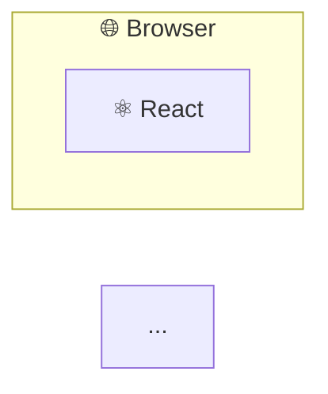
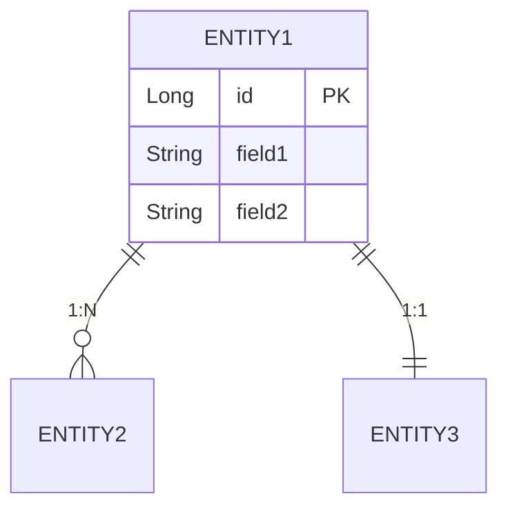

# README Writer Skill

## Purpose

프로젝트의 코드베이스를 분석하여 README.md를 자동으로 생성하거나 업데이트합니다.
기존 README가 있으면 최신 상태로 갱신하고, 없으면 새로 작성합니다.

## When to Activate

- 사용자가 "리드미 써줘", "README 업데이트", "문서화" 등을 요청할 때
- `/readme-writer` 명령어로 직접 호출할 때

## Workflow

### 1. 프로젝트 분석 (필수)

먼저 프로젝트 구조를 파악합니다:

```
1. package.json / build.gradle / pom.xml 등에서 프로젝트 메타데이터 추출
2. 디렉토리 구조 파악 (src/, frontend/, backend/ 등)
3. 기존 README.md가 있으면 읽어서 유지할 섹션 파악
4. .env.example, docker-compose.yml 등에서 설정 정보 추출
5. API 컨트롤러에서 엔드포인트 목록 추출
```

### 2. 스타일 선택

| Style | 설명 | 용도 |
|-------|------|------|
| `minimal` | 프로젝트명, 설명, 설치/실행 방법만 | 간단한 프로젝트, 내부용 |
| `standard` | + 기능 목록, 기술 스택, 스크린샷 | 일반적인 오픈소스 |
| `detailed` | + 아키텍처 다이어그램, 도메인 모델, API 문서, 프로젝트 구조 | 대규모 프로젝트 |

기본값: `detailed`

### 3. README 구조 (detailed 기준)

```markdown
# 🎲 프로젝트명

> 한 줄 설명

프로젝트 소개 문단

👉 **[Demo 바로가기](https://...)**

---

## ✨ 주요 기능

### 🏠 기능1
- 상세 설명

### 🔍 기능2
- 상세 설명

---

## 🛠 기술 스택

### Backend
| Category | Technology |
|----------|------------|
| Framework |  |

### Frontend
| Category | Technology |
|----------|------------|
| Framework |  |

### Infrastructure
| Category | Technology |
|----------|------------|
| Container |  |

---

## 📸 스크린샷

### 화면1


---

## 🏗 아키텍처



### 도메인 모델

```mermaid
erDiagram
    USER ||--o{ ENTITY : "관계"
    ...
```

---

## 🚀 실행 방법

### 요구사항
- Java 25+
- Node.js 20+
- Docker

### 1. 저장소 클론
```bash
git clone https://github.com/...
cd project
```

### 2. 인프라 실행
```bash
docker-compose up -d
```

### 3. 백엔드 실행
```bash
cd backend && ./gradlew bootRun
```

### 4. 프론트엔드 실행
```bash
cd frontend && npm install && npm run dev
```

---

## 📁 프로젝트 구조

```
project/
├── backend/
│   └── src/main/java/...
├── frontend/
│   └── src/
└── ...
```

---

## 📝 API 문서

서버 실행 후 Swagger UI에서 확인:
```
http://localhost:8080/swagger-ui.html
```

### 주요 엔드포인트

| Method | Endpoint | Description |
|--------|----------|-------------|
| POST | `/api/...` | 설명 |
| GET | `/api/...` | 설명 |

---

## 🧪 테스트

```bash
# 백엔드
cd backend && ./gradlew test

# 프론트엔드
cd frontend && npm run lint
```

---

## 📄 라이선스

MIT License
```

### 4. 작성 규칙

1. **이모지 사용**: 섹션 제목에 관련 이모지 사용 (🎲✨🏠🔍📊💬⭐🔔🛠📸🏗🚀📁📝🧪📄)
2. **한국어 우선**: 사용자가 한국어로 요청하면 한국어로 작성
3. **실제 정보만**: 추측하지 말고 코드에서 확인된 정보만 작성
4. **명령어 검증**: 실제 동작하는 명령어만 기재 (package.json scripts 확인)
5. **배지 사용**: 기술 스택은 shields.io 배지로 시각화
6. **Mermaid 다이어그램**: 아키텍처와 도메인 모델은 Mermaid로 시각화
7. **Demo 링크**: 배포된 서비스가 있으면 상단에 링크 추가
8. **구분선**: 주요 섹션 사이에 `---` 사용

### 5. 배지 형식

```markdown

```

주요 색상:
- Spring Boot: `6DB33F`
- React: `61DAFB`
- TypeScript: `3178C6`
- PostgreSQL: `4169E1`
- Redis: `DC382D`
- Docker: `2496ED`
- Java: `ED8B00`
- Vite: `646CFF`
- Tailwind: `06B6D4`

### 6. Mermaid 다이어그램 스타일

아키텍처 다이어그램:
```mermaid
flowchart LR
    subgraph Name["이모지 이름"]
        NODE["이모지 설명"]
    end

    style Name fill:#색상,stroke:#테두리색,color:#글자색
```

도메인 모델 (ER 다이어그램):


## Examples

```
사용자: 리드미 써줘
Claude: [detailed 스타일로 전체 README 작성]

사용자: /readme-writer minimal
Claude: [minimal 스타일로 간단한 README 작성]

사용자: README 최신화해줘
Claude: [기존 README 분석 후 변경된 부분만 업데이트]

사용자: 소믈리에 기능 추가했으니까 리드미 업데이트해줘
Claude: [주요 기능 섹션에 소믈리에 추가, API 문서에 엔드포인트 추가]
```

## Notes

- 스크린샷은 `docs/images/` 폴더에서 찾음
- 라이선스는 LICENSE 파일이 있으면 자동 감지
- 기존 README의 커스텀 섹션은 유지
- 민감한 정보(API 키, 비밀번호)는 절대 포함하지 않음
- 버전 정보는 package.json, build.gradle 등에서 추출
- 배포 URL이 있으면 상단에 Demo 링크 추가
