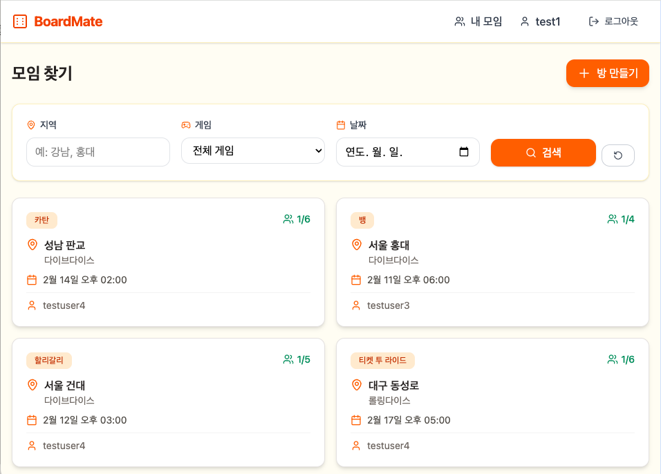
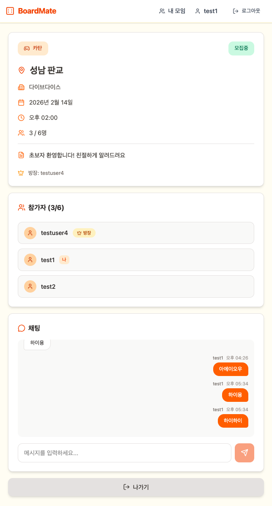

# 🎲 Board-Mate

> 보드게임 모임을 더 쉽게, 더 즐겁게

Board-Mate는 보드게임을 좋아하는 사람들이 쉽게 모임을 만들고 참여할 수 있는 매칭 플랫폼입니다.


---

## ✨ 주요 기능

### 🏠 방 생성 및 참가
- 원하는 게임, 지역, 날짜로 모임 생성
- 실시간 참가자 현황 확인
- 무한 스크롤로 편리한 방 목록 탐색

### 🔍 검색 및 필터
- 지역, 게임, 날짜별 필터링
- 페이지네이션 적용으로 빠른 로딩

### 📊 신뢰도 시스템
- 출석/노쇼 기반 신뢰도 점수
- S~F 등급으로 사용자 신뢰도 표시
- 건강한 커뮤니티 문화 조성

### 🔔 실시간 알림
- WebSocket 기반 실시간 알림
- 참가자 입/퇴장 즉시 반영
- 게임 종료 및 출석 체크 알림

---

## 🛠 기술 스택

### Backend

| Category | Technology |
|----------|------------|
| Framework |  |
| Language |  |
| Database |  |
| Cache |  |
| Auth |  |
| Real-time |  |
| Build |  |
| Docs |  |

### Frontend

| Category | Technology |
|----------|------------|
| Framework |  |
| Language |  |
| Build |  |
| Styling |  |
| State |  |
| Icons |  |
| HTTP |  |

### Infrastructure

| Category | Technology |
|----------|------------|
| Container |  |
| Test |   |

---

## 📸 스크린샷

### 방 목록 (무한 스크롤)


### 방 상세 (실시간 참가자)


---

## 🏗 아키텍처

```
┌─────────────────────────────────────────────────────────────────┐
│                         Client (Browser)                         │
│  ┌───────────────────────────────────────────────────────────┐  │
│  │   React 19 + TypeScript + Vite + Tailwind CSS             │  │
│  │   ┌─────────┐  ┌─────────┐  ┌─────────┐  ┌─────────┐     │  │
│  │   │ Zustand │  │  Axios  │  │ STOMP.js│  │ Router  │     │  │
│  │   └─────────┘  └─────────┘  └─────────┘  └─────────┘     │  │
│  └───────────────────────────────────────────────────────────┘  │
└─────────────────────────────────────────────────────────────────┘
                    │ HTTP/REST          │ WebSocket
                    ▼                    ▼
┌─────────────────────────────────────────────────────────────────┐
│                     Spring Boot Application                      │
│  ┌───────────────────────────────────────────────────────────┐  │
│  │                      Controller Layer                      │  │
│  │   Auth │ Room │ Participant │ Game │ TrustScore           │  │
│  └───────────────────────────────────────────────────────────┘  │
│  ┌───────────────────────────────────────────────────────────┐  │
│  │                       Service Layer                        │  │
│  │   JWT Auth │ Room CRUD │ Attendance │ Notification        │  │
│  └───────────────────────────────────────────────────────────┘  │
│  ┌───────────────────────────────────────────────────────────┐  │
│  │                     Repository Layer                       │  │
│  │   JPA │ Specification │ Pessimistic Lock                  │  │
│  └───────────────────────────────────────────────────────────┘  │
└─────────────────────────────────────────────────────────────────┘
                    │                    │
                    ▼                    ▼
┌──────────────────────┐    ┌──────────────────────┐
│   PostgreSQL 16      │    │      Redis 7         │
│   ┌──────────────┐   │    │   ┌──────────────┐   │
│   │ users        │   │    │   │ sessions     │   │
│   │ rooms        │   │    │   │ cache        │   │
│   │ participants │   │    │   └──────────────┘   │
│   │ board_games  │   │    │                      │
│   │ trust_scores │   │    │                      │
│   └──────────────┘   │    │                      │
└──────────────────────┘    └──────────────────────┘
```

### 도메인 모델

```
┌───────────┐       ┌───────────┐       ┌───────────┐
│   User    │◀──────│Participant│──────▶│   Room    │
│───────────│  1:N  │───────────│  N:1  │───────────│
│ id        │       │ id        │       │ id        │
│ email     │       │ status    │       │ region    │
│ nickname  │       │ attendedAt│       │ gameDate  │
└───────────┘       └───────────┘       └───────────┘
      │                                       │
      │ 1:1                              N:1  │
      ▼                                       ▼
┌───────────┐                          ┌───────────┐
│TrustScore │                          │ BoardGame │
│───────────│                          │───────────│
│ score     │                          │ title     │
│ grade     │                          │ players   │
│ attended  │                          │ playtime  │
│ noShow    │                          │ difficulty│
└───────────┘                          └───────────┘
```

---

## 🚀 실행 방법

### 요구사항
- Java 25+
- Node.js 20+
- Docker & Docker Compose

### 1. 저장소 클론
```bash
git clone https://github.com/your-username/board-mate.git
cd board-mate
```

### 2. 인프라 실행 (PostgreSQL + Redis)
```bash
cd backend
docker-compose up -d
```

### 3. 백엔드 실행
```bash
cd backend
./gradlew bootRun
# http://localhost:8080
```

### 4. 프론트엔드 실행
```bash
cd frontend
npm install
npm run dev
# http://localhost:5173
```

### 5. 테스트 데이터 생성 (선택)
```bash
./scripts/generate-test-data.sh
# 테스트 계정: testuser1@test.com ~ testuser5@test.com
# 비밀번호: test1234
```

---

## 📁 프로젝트 구조

```
board-mate/
├── backend/
│   ├── src/main/java/com/benny/board_mate/
│   │   ├── auth/           # 인증 (JWT)
│   │   ├── user/           # 사용자
│   │   ├── room/           # 방 관리
│   │   ├── participant/    # 참가자/출석
│   │   ├── game/           # 보드게임 카탈로그
│   │   ├── trust/          # 신뢰도 시스템
│   │   ├── notification/   # WebSocket 알림
│   │   └── common/         # 공통 (config, exception)
│   ├── docker-compose.yml
│   └── build.gradle
│
├── frontend/
│   ├── src/
│   │   ├── pages/          # 페이지 컴포넌트
│   │   ├── components/     # 공용 컴포넌트
│   │   ├── api/            # API 클라이언트
│   │   ├── stores/         # Zustand 상태
│   │   ├── types/          # TypeScript 타입
│   │   └── hooks/          # 커스텀 훅
│   ├── package.json
│   └── vite.config.ts
│
└── scripts/
    └── generate-test-data.sh
```

---

## 📝 API 문서

서버 실행 후 Swagger UI에서 확인:
```
http://localhost:8080/swagger-ui.html
```

### 주요 엔드포인트

| Method | Endpoint | Description |
|--------|----------|-------------|
| POST | `/api/auth/signup` | 회원가입 |
| POST | `/api/auth/login` | 로그인 |
| GET | `/api/rooms` | 방 목록 (페이징 + 필터) |
| POST | `/api/rooms` | 방 생성 |
| GET | `/api/rooms/{id}` | 방 상세 |
| POST | `/api/rooms/{id}/participants` | 참가 |
| DELETE | `/api/rooms/{id}/participants` | 퇴장 |
| GET | `/api/games` | 게임 목록 |
| WS | `/ws` | WebSocket 연결 |

---

## 🧪 테스트

```bash
# 백엔드 테스트
cd backend
./gradlew test

# 프론트엔드 타입 체크
cd frontend
npm run lint
```

---

## 📄 라이선스

MIT License
